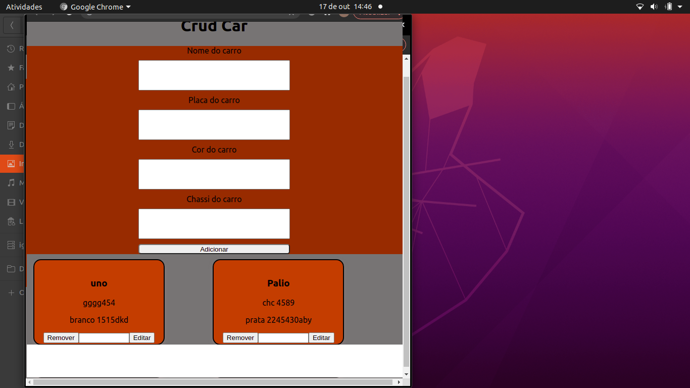

# Bem vindo ao Cadastro de ALunos CRUD!

Este projeto através do teste prático simula um protótipo de crud, em que suas funções em Adicionar, ler, atualizar e deletar.
---

# Sumário
- [Habilidades](#Habilidades)
- [Instalação](#Instação)
- [importações](#Execucão)

# Habilidades 

Nesse projeto, foi utilizado um back-end usando `ORM` com o pacote `sequelize` do `npm`, juntamente ao `node.js` e no Front-End `react.js`

# Instalação:

### Atenção aos requisitos e procedimentos:

1. Clone o repositório
  * `git clone git@github.com:Igor-leao/car-shop-crud.git`.
  * Entre na pasta do repositório que você acabou de clonar:
    * `car-shop-crud`

2. Instale as dependências [**Caso existam**]
  * `npm install`
* ``
  
3. Caso queira instalar separadamente
  * `sudo apt update`
  * `sudo apt install nodejs`
  * `npm i sequelize`
  * `npm i mysql2`
  * `npm install body-parser`
`

---

# Execucão:

* Entre na pasta `backend` e vá ao arquivo `index.js` e informe os dados do seu banco de dados para execução 

`host: process.env.HOSTNAME`

`user: process.env.MYSQL_USER`

`password: process.env.MYSQL_PASSWORD`

* Caso prefira, no `script.sql` já tem um esquema para criar a base de dados e a tabela, e também um dado inicial.

* Entre na pasta `backend` e no terminal execute `npm run start` Para executar o Back-End

* Entre na pasta `frontend` e no terminal execute `npm start` Para executar o react native, como a foto a seguir

